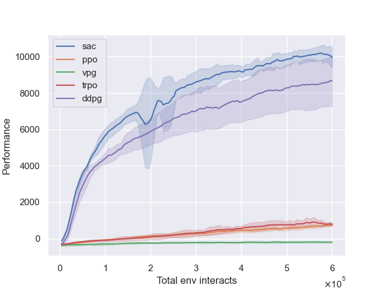
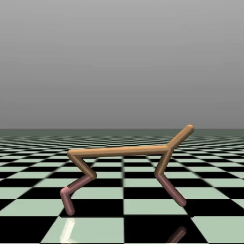

# Deep RL Zoo
A collection of Deep Reinforcement Learning algorithms implemented with Pytorch, strongly based on OpenAI's [Spinning Up](https://github.com/openai/spinningup).  

The collection is divided into two sets:
- Single-agent methods:
    - Consisting of [DQN](./zoo/single/dqn.py), [VPG](./zoo/single/vpg.py) (i.e. REINFORCE), [PPO](./zoo/single/ppo.py), [TRPO](./zoo/single/trpo.py), [DDPG](./zoo/single/ddpg.py), [SAC](./zoo/single/sac.py).
    - Training & testing environment: [Gymnasium](https://gymnasium.farama.org), a maintained fork of [OpenAI's Gym](https://github.com/openai/gym).
- Multi-agent methods:
    - Consisting of [MADDPG](./zoo/multi/maddpg.py).
    - Training & testing environment: Multi Particle Environments ([MPE](https://pettingzoo.farama.org/environments/mpe/)) - [PettingZoo](https://pettingzoo.farama.org).

## Setup
The project is running on Python 3.11. To install dependencies, run the command
```bash
pip install -r requirements.txt
```

## Running experiment
Each experiment with default setting can be run directly as
```bash
python zoo/single/sac.py
```
or can be run through `run.py`
```bash
python -m run sac
```
The latter enables running `n` experiments with different seeds `(0, ..., n-1)` at once. For example, to perform 5 experiments with SAC agent (with default settings), run the command
```bash
python -m run sac -n 5
```

To customize experiment settings, check out each algorithm file for more detailed. For example, here are the arguments used in SAC
```
usage: sac.py [-h] [--env ENV] [--exp-name EXP_NAME] [--seed SEED]
              [--hidden-sizes HIDDEN_SIZES [HIDDEN_SIZES ...]] [--lr LR]
              [--epochs EPOCHS] [--steps-per-epoch STEPS_PER_EPOCH]
              [--max-ep-len MAX_EP_LEN] [--buffer-size BUFFER_SIZE]
              [--batch-size BATCH_SIZE] [--start-step START_STEP]
              [--update-every UPDATE_EVERY] [--update-after UPDATE_AFTER]
              [--gamma GAMMA] [--tau TAU] [--ent-coeff ENT_COEFF]
              [--adjust-ent-coeff] [--ent-coeff-init ENT_COEFF_INIT]
              [--ent-target ENT_TARGET] [--test-episodes TEST_EPISODES] [--save]
              [--save-every SAVE_EVERY] [--render] [--plot]

Soft Actor-Critic

optional arguments:
  -h, --help            show this help message and exit
  --env ENV             Environment ID
  --exp-name EXP_NAME   Experiment name
  --seed SEED           Seed for RNG
  --hidden-sizes HIDDEN_SIZES [HIDDEN_SIZES ...]
                        Sizes of policy & Q networks' hidden layers
  --lr LR               Learning rate for policy, Q networks & entropy coefficient
                        optimizers
  --epochs EPOCHS       Number of epochs
  --steps-per-epoch STEPS_PER_EPOCH
                        Maximum number of steps for each epoch
  --max-ep-len MAX_EP_LEN
                        Maximum episode/trajectory length
  --buffer-size BUFFER_SIZE
                        Replay buffer size
  --batch-size BATCH_SIZE
                        Minibatch size
  --start-step START_STEP
                        Start step to begin action selection according to policy
                        network
  --update-every UPDATE_EVERY
                        Parameters update frequency
  --update-after UPDATE_AFTER
                        Number of steps after which update is allowed
  --gamma GAMMA         Discount factor
  --tau TAU             Soft (Polyak averaging) update coefficient
  --ent-coeff ENT_COEFF
                        Entropy regularization coefficient
  --adjust-ent-coeff    Whether to enable automating entropy adjustment scheme
  --ent-coeff-init ENT_COEFF_INIT
                        Initial value for automating entropy adjustment scheme
  --ent-target ENT_TARGET
                        Desired entropy, used for automating entropy adjustment
  --test-episodes TEST_EPISODES
                        Number of episodes to test the deterministic policy at the
                        end of each epoch
  --save                Whether to save the final model
  --save-every SAVE_EVERY
                        Model saving frequency
  --render              Whether to render the training result
  --plot                Whether to plot the training statistics
```

## Plotting results
```bash
usage: plot.py [-h] [--log-dirs LOG_DIRS [LOG_DIRS ...]] [-x [{epoch,total-env-interacts} ...]] [-y [Y_AXIS ...]]
               [-s SAVEDIR]

Results plotting

optional arguments:
  -h, --help            show this help message and exit
  --log-dirs LOG_DIRS [LOG_DIRS ...]
                        Directories for saving log files
  -x [{epoch,total-env-interacts} ...], --x-axis [{epoch,total-env-interacts} ...]
                        Horizontal axes to plot
  -y [Y_AXIS ...], --y-axis [Y_AXIS ...]
                        Vertical axes to plot
  -s SAVEDIR, --savedir SAVEDIR
                        Directory to save plotting results
```

## Testing policy
Result policy can be tested via the following command
```bash
python -m run test_policy --log-dir path/to/the/log/dir
```
where `path/to/the/log/dir` is path to the log directory, which stores model file, config file, etc. For more details, check out the following
```bash
usage: test_policy.py [-h] --log-dir LOG_DIR [--eps EPS] [--max-ep-len MAX_EP_LEN]
                      [--render]

Policy testing

optional arguments:
  -h, --help            show this help message and exit
  --log-dir LOG_DIR     Path to the log directory, which stores model file, config file,
                        etc
  --eps EPS             Number of episodes
  --max-ep-len MAX_EP_LEN
                        Maximum length of an episode
  --render              Whether to render the experiment
```

## Some results



## References
[1] Josh Achiam. [Spinning Up in Deep Reinforcement Learning](https://spinningup.openai.com/). SpinningUp2018, 2018.  
[2] Richard S. Sutton & Andrew G. Barto. [Reinforcement Learning: An Introduction](https://mitpress.mit.edu/books/reinforcement-learning-second-edition). MIT press, 2018.  
[3] Vlad Mnih, et al. [Playing Atari with Deep Reinforcement Learning](https://www.cs.toronto.edu/~vmnih/docs/dqn.pdf), 2013.  
[4] Vlad Mnih, et al. [Human Level Control Through Deep Reinforcement Learning](https://www.deepmind.com/publications/human-level-control-through-deep-reinforcement-learning). Nature, 2015.  
[5] Hado van Hasselt, Arthur Guez, David Silver. [Deep Reinforcement Learning with Double Q-learning](https://arxiv.org/abs/1509.06461). AAAI16, 2016.  
[6] Ziyu Wang, Tom Schaul, Matteo Hessel, Hado van Hasselt, Marc Lanctot, Nando de Freitas. [Dueling Network Architectures for Deep Reinforcement Learning](https://arxiv.org/abs/1511.06581). arXiv preprint, arXiv:1511.06581, 2015.  
[7] John Schulman, Filip Wolski, Prafulla Dhariwal, Alec Radford, Oleg Klimov. [Proximal Policy Optimization Algorithms](https://arxiv.org/abs/1707.06347). arXiv preprint, arXiv:1707.06347, 2017.  
[8] John Schulman, Sergey Levine, Philipp Moritz, Michael I. Jordan, Pieter Abbeel. [Trust Region Policy Optimization](https://dl.acm.org/doi/10.5555/3045118.3045319). ICML'15, pp 1889–1897, 2015.  
[9] John Schulman, Philipp Moritz, Sergey Levine, Michael Jordan, Pieter Abbeel. [High-Dimensional Continuous Control Using Generalized Advantage Estimation](https://arxiv.org/abs/1506.02438). ICLR 2016.    
[10] David Silver, Guy Lever, Nicolas Heess, Thomas Degris, Daan Wierstra, Martin Riedmiller. [Deterministic Policy Gradient Algorithms](http://proceedings.mlr.press/v32/silver14.pdf). JMLR 2014.  
[11] Timothy P. Lillicrap, Jonathan J. Hunt, Alexander Pritzel, Nicolas Heess, Tom Erez, Yuval Tassa, David Silver, Daan Wierstra. [Continuous control with deep reinforcement learning](https://arxiv.org/pdf/1509.02971.pdf). ICLR 2016.  
[12] Tuomas Haarnoja, Haoran Tang, Pieter Abbeel, Sergey Levine. [Reinforcement Learning with Deep Energy-Based Policies](https://dl.acm.org/doi/10.5555/3305381.3305521). ICML, 2017.  
[13] Ryan Lowe, Yi Wu, Aviv Tamar, Jean Harb, Pieter Abbeel, Igor Mordatch. [Multi-Agent Actor-Critic for Mixed Cooperative-Competitive Environments](https://arxiv.org/abs/1706.02275). NIPS 2017.  
[14] Eric Jang, Shixiang Gu, Ben Poole. [Categorical Reparameterization with Gumbel-Softmax](https://arxiv.org/abs/1611.01144). ICLR 2017.  
[15] Chris J. Maddison, Andriy Mnih, Yee Whye Teh. [The Concrete Distribution: A Continuous Relaxation of Discrete Random Variables](https://arxiv.org/abs/1611.00712). ICLR 2017.
